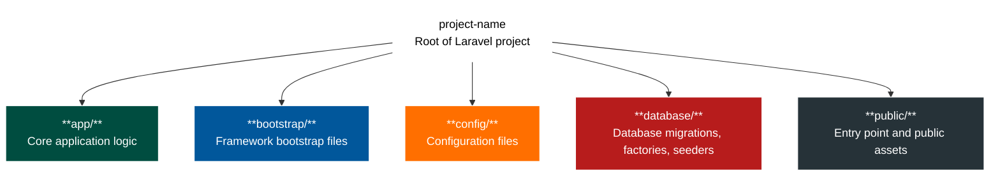
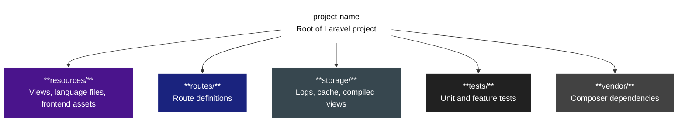
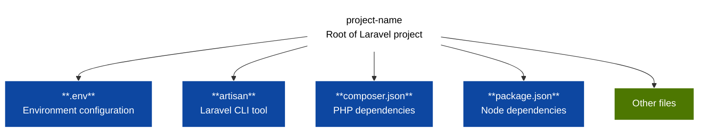
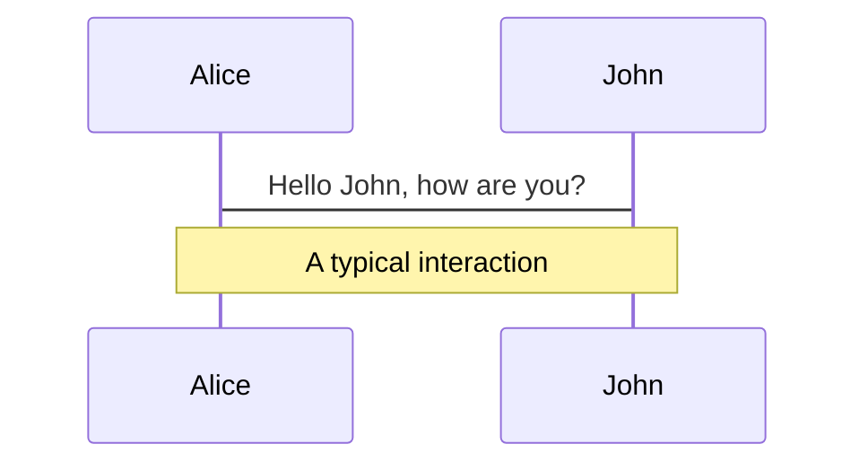
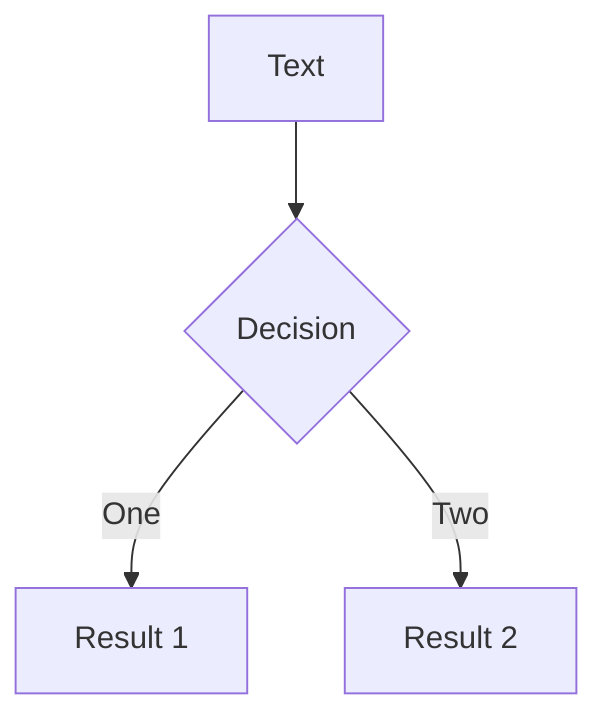
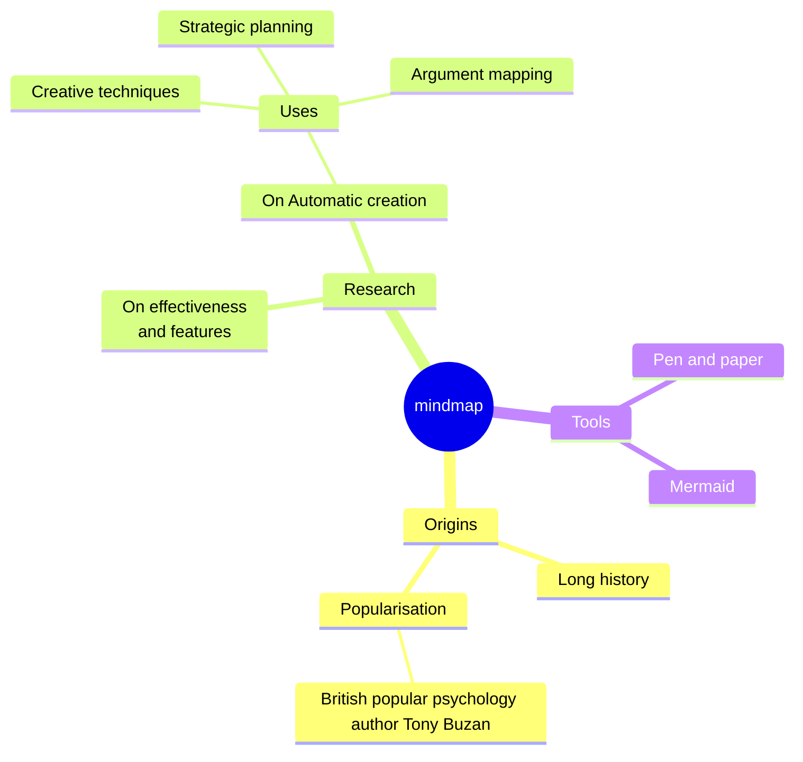
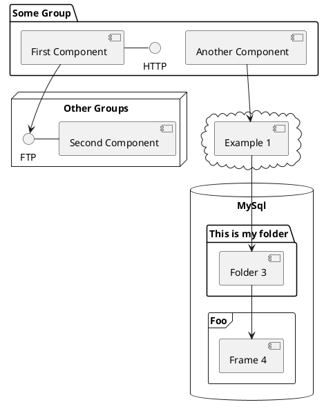

---
# try also 'default' to start simple
theme: ./theme
# random image from a curated Unsplash collection by Anthony
# like them? see https://unsplash.com/collections/94734566/slidev
background: ./theme/assets/slidev-background.svg
# some information about your slides (markdown enabled)
title: Welcome to Slidev
info: ...
author: Adrian Gould <adrian.gould@nmtafe.wa.edu.au>
description: TBA
keywords: [Adrian Gould, Laravel, CORS, SaaS, Back-End, REST]
# apply UnoCSS classes to the current slide
class: text-left
# https://sli.dev/features/drawing
drawings:
  persist: false
# slide transition: https://sli.dev/guide/animations.html#slide-transitions
transition: slide-left
# enable MDC Syntax: https://sli.dev/features/mdc
mdc: true
# duration of the presentation
duration: 35min
# aspect ratio for the slides
aspectRatio: 16/9
# real width of the canvas, unit in px
canvasWidth: 1080
lineNumbers: true
---

# Welcome to Slidev

Presentation slides for developers

<div @click="$slidev.nav.next" class="mt-12 py-1" hover:bg="white op-10">
  Press Space for next page <carbon:arrow-right />
</div>

<div class="abs-br m-6 text-xl">
  <button @click="$slidev.nav.openInEditor()" title="Open in Editor" class="slidev-icon-btn">
    <carbon:edit />
  </button>
  <a href="https://github.com/slidevjs/slidev" target="_blank" class="slidev-icon-btn">
    <carbon:logo-github />
  </a>
</div>

<!--
The last comment block of each slide will be treated as slide notes. It will be visible and editable in Presenter Mode along with the slide. [Read more in the docs](https://sli.dev/guide/syntax.html#notes)
-->


---
layout: about-me

helloMsg: Hello there!
name: Adrian Gould
imageSrc: ./theme/assets/ady-202401-2.jpg
position: left
job: "Lecturer, ASL | Coach | Mentor"
line1: "@ North Metropolitan TAFE"
line2: "Web App Dev, IoT Dev, and more"
line3: "Manager: Screencraft, SQuASH"
email: "adrian.gould@nmtafe.wa.edu.au"
social2: "Helpdesk: https://help.screencraft.net.au"
social3: https://github.com/AdyGCode
---

---
layout: default
transition: fade-out
background: ./theme/assets/slidev-background-gray.svg
---

# What is Slidev?


Slidev is a slides maker and presenter designed for developers, consist of the following features

- 📝 **Text-based** - focus on the content with Markdown, and then style them later
- 🎨 **Themable** - themes can be shared and re-used as npm packages
- 🧑‍💻 **Developer Friendly** - code highlighting, live coding with autocompletion
- 🤹 **Interactive** - embed Vue components to enhance your expressions
- 🎥 **Recording** - built-in recording and camera view
- 📤 **Portable** - export to PDF, PPTX, PNGs, or even a hostable SPA
- 🛠 **Hackable** - virtually anything that's possible on a webpage is possible in Slidev
<br>
<br>

Read more about [Why Slidev?](https://sli.dev/guide/why)

<!--
You can have `style` tag in markdown to override the style for the current page.
Learn more: https://sli.dev/features/slide-scope-style
-->

<style>
h1 {
  background-color: #2B90B6;
  background-image: linear-gradient(45deg, #4EC5D4 10%, #146b8c 20%);
  background-size: 100%;
  -webkit-background-clip: text;
  -moz-background-clip: text;
  -webkit-text-fill-color: transparent;
  -moz-text-fill-color: transparent;
}
</style>

<!--
Here is another comment.
-->

---
layout: default
background: ./theme/assets/slidev-background-gray.svg
transition: slide-up
level: 2
---

# Navigation

Hover on the bottom-left corner to see the navigation's controls panel, [learn more](https://sli.dev/guide/ui#navigation-bar)

## Keyboard Shortcuts

|                                                     |                             |
| --------------------------------------------------- | --------------------------- |
| <kbd>right</kbd> / <kbd>space</kbd>                 | next animation or slide     |
| <kbd>left</kbd>  / <kbd>shift</kbd><kbd>space</kbd> | previous animation or slide |
| <kbd>up</kbd>                                       | previous slide              |
| <kbd>down</kbd>                                     | next slide                  |

<!-- https://sli.dev/guide/animations.html#click-animation -->

<p v-after class="absolute bottom-23 left-45 opacity-30 transform -rotate-10">Here!</p>

---
layout: two-cols
background: ./theme/assets/slidev-background-gray.svg
layoutClass: gap-16
---

# Table of contents

You can use the `Toc` component to generate a table of contents for your slides:

```html
<Toc minDepth="1" maxDepth="1" />
```

The title will be inferred from your slide content, or you can override it with `title` and `level` in your frontmatter.

::right::

<Toc text-sm minDepth="1" maxDepth="2" />

---
layout: image-right
background: ./theme/assets/slidev-background-gray.svg
image: https://cover.sli.dev
---

# Code

Use code snippets and get the highlighting directly, and even types hover!

```ts [filename-example.ts] {all|4|6|6-7|9|all} twoslash
// TwoSlash enables TypeScript hover information
// and errors in markdown code blocks
// More at https://shiki.style/packages/twoslash
import { computed, ref } from 'vue'

const count = ref(0)
const doubled = computed(() => count.value * 2)

doubled.value = 2
```

<arrow v-click="[4, 5]" x1="350" y1="310" x2="195" y2="342" color="#953" width="2" arrowSize="1" />

<!-- This allow you to embed external code blocks -->
<<< @/snippets/external.ts#snippet

<!-- Footer -->

[Learn more](https://sli.dev/features/line-highlighting)

<!-- Inline style -->
<style>
.footnotes-sep {
  @apply mt-5 opacity-10;
}
.footnotes {
  @apply text-sm opacity-75;
}
.footnote-backref {
  display: none;
}
</style>

<!--
Notes can also sync with clicks

[click] This will be highlighted after the first click

[click] Highlighted with `count = ref(0)`

[click:3] Last click (skip two clicks)
-->

---
layout: default
background: ./theme/assets/slidev-background-gray.svg
level: 2
---

# Shiki Magic Move

Powered by [shiki-magic-move](https://shiki-magic-move.netlify.app/), Slidev supports animations across multiple code snippets.

Add multiple code blocks and wrap them with <code>````md magic-move</code> (four backticks) to enable the magic move. For example:

````md magic-move {lines: true}
```ts {*|2|*}
// step 1
const author = reactive({
  name: 'John Doe',
  books: [
    'Vue 2 - Advanced Guide',
    'Vue 3 - Basic Guide',
    'Vue 4 - The Mystery'
  ]
})
```

```ts {*|1-2|3-4|3-4,8}
// step 2
export default {
  data() {
    return {
      author: {
        name: 'John Doe',
        books: [
          'Vue 2 - Advanced Guide',
          'Vue 3 - Basic Guide',
          'Vue 4 - The Mystery'
        ]
      }
    }
  }
}
```

```ts
// step 3
export default {
  data: () => ({
    author: {
      name: 'John Doe',
      books: [
        'Vue 2 - Advanced Guide',
        'Vue 3 - Basic Guide',
        'Vue 4 - The Mystery'
      ]
    }
  })
}
```

Non-code blocks are ignored.

```vue
<!-- step 4 -->
<script setup>
const author = {
  name: 'John Doe',
  books: [
    'Vue 2 - Advanced Guide',
    'Vue 3 - Basic Guide',
    'Vue 4 - The Mystery'
  ]
}
</script>
```
````

---
layout: default
background: ./theme/assets/slidev-background-gray.svg
---

# Blank page with title

---
layout: one-two-cols
background: ./theme/assets/slidev-background-gray.svg
---

::title::
# 1:2 Column Code with Shiki and The unnamed theme

::left::
The code highlighting is powered by Shiki and [The unnamed - VS Code theme](https://marketplace.visualstudio.com/items?itemName=eliostruyf.vscode-unnamed-theme)

::right::
```php [php] {none|6-7|8-9|10-11|12-13|all}{maxHeight:'600px'} ts 
return new class extends Migration {

    public function up(): void
    {
        Schema::create('categories', function (Blueprint $table) {
            // unsigned big integer, autoincrement and PK
            $table->id();        
            // string (max-length 64), required   
            $table->string('title', 64);
            // string (max-length 255), optional
            $table->string('description', 255)->nullable();
            // created_at, updated_at are both created
            $table->timestamps();
        });
    }
    //...
}
```

---
layout: default
background: ./theme/assets/slidev-background-gray.svg
---

# Components

<div grid="~ cols-2 gap-4">
<div>

You can use Vue components directly inside your slides.

We have provided a few built-in components like `<Tweet/>` and `<Youtube/>` that you can use directly. And adding your custom components is also super easy.

```html
<Counter :count="10" />
```

<!-- ./components/Counter.vue -->
<Counter :count="10" m="t-4" />

Check out [the guides](https://sli.dev/builtin/components.html) for more.

</div>
<div>

```html
<Tweet id="1390115482657726468" />
```

<Tweet id="1390115482657726468" scale="0.565" />

</div>
</div>

<!--
Presenter note with **bold**, *italic*, and ~~striked~~ text.

Also, HTML elements are valid:
<div class="flex w-full">
  <span style="flex-grow: 1;">Left content</span>
  <span>Right content</span>
</div>
-->

---
layout: default
background: ./theme/assets/slidev-background-gray.svg
class: px-20
---

# Themes

Slidev comes with powerful theming support. Themes can provide styles, layouts, components, or even configurations for tools. Switching between themes by just **one edit** in your frontmatter:

<div grid="~ cols-2 gap-2" m="t-2">

```yaml
---
theme: default
---
```

```yaml
---
theme: seriph
---
```


</div>

Read more about [How to use a theme](https://sli.dev/guide/theme-addon#use-theme) and
check out the [Awesome Themes Gallery](https://sli.dev/resources/theme-gallery).


---
layout: default
background: ./theme/assets/slidev-background-gray.svg
---

# Clicks Animations

You can add `v-click` to elements to add a click animation.

<div v-click>

This shows up when you click the slide:

```html
<div v-click>This shows up when you click the slide.</div>
```

</div>

<br>

<v-click>

The <span v-mark.red="3"><code>v-mark</code> directive</span>
also allows you to add
<span v-mark.circle.orange="4">inline marks</span>
, powered by [Rough Notation](https://roughnotation.com/):

```html
<span v-mark.underline.orange>inline markers</span>
```

</v-click>

<div mt-20 v-click>

[Learn more](https://sli.dev/guide/animations#click-animation)

</div>

---
layout: default
background: ./theme/assets/slidev-background-gray.svg
---

# Motions

Motion animations are powered by [@vueuse/motion](https://motion.vueuse.org/), triggered by `v-motion` directive.

```html
<div
  v-motion
  :initial="{ x: -80 }"
  :enter="{ x: 0 }"
  :click-3="{ x: 80 }"
  :leave="{ x: 1000 }"
>
  Slidev
</div>
```

<div class="w-60 relative">
  <div class="relative w-40 h-40">
    
    
    
  </div>

  <div
    class="text-5xl absolute top-14 left-40 text-[#2B90B6] -z-1"
    v-motion
    :initial="{ x: -80, opacity: 0}"
    :enter="{ x: 0, opacity: 1, transition: { delay: 2000, duration: 1000 } }">
    Slidev
  </div>
</div>

<!-- vue script setup scripts can be directly used in markdown, and will only affects current page -->
<script setup lang="ts">
const final = {
  x: 0,
  y: 0,
  rotate: 0,
  scale: 1,
  transition: {
    type: 'spring',
    damping: 10,
    stiffness: 20,
    mass: 2
  }
}
</script>

<div
  v-motion
  :initial="{ x:35, y: 30, opacity: 0}"
  :enter="{ y: 0, opacity: 1, transition: { delay: 3500 } }">

[Learn more](https://sli.dev/guide/animations.html#motion)

</div>

---
layout: default
background: ./theme/assets/slidev-background-gray.svg
---

# $\LaTeX$

$\LaTeX$ is supported out-of-box. Powered by [$\KaTeX$](https://katex.org/).

<div h-3 />

Inline $\sqrt{3x-1}+(1+x)^2$

Block
$$ {1|3|all}
\begin{aligned}
\nabla \cdot \vec{E} &= \frac{\rho}{\varepsilon_0} \\
\nabla \cdot \vec{B} &= 0 \\
\nabla \times \vec{E} &= -\frac{\partial\vec{B}}{\partial t} \\
\nabla \times \vec{B} &= \mu_0\vec{J} + \mu_0\varepsilon_0\frac{\partial\vec{E}}{\partial t}
\end{aligned}
$$

[Learn more](https://sli.dev/features/latex)

---
layout: default
background: ./theme/assets/slidev-background-gray.svg
---

# Laravel Folder Structure

We have split this into three sections.







---
layout: default
background: ./theme/assets/slidev-background-gray.svg
---

# Diagrams

You can create diagrams / graphs from textual descriptions, directly in your Markdown.

<div class="grid grid-cols-4 gap-5 pt-4 -mb-6">









</div>

Learn more: [Mermaid Diagrams](https://sli.dev/features/mermaid) and [PlantUML Diagrams](https://sli.dev/features/plantuml)

---
foo: bar
dragPos:
  square: 658,409,92,_,-16
---

# Draggable Elements

Double-click on the draggable elements to edit their positions.

<br>

###### Directive Usage

```md

```

<br>

###### Component Usage

```md
<v-drag text-3xl>
  <div class="i-carbon:arrow-up" />
  Use the `v-drag` component to have a draggable container!
</v-drag>
```

<v-drag pos="706,395,261,_,81">
  <div text-center text-3xl border border-main rounded>
    Double-click me!
  </div>
</v-drag>


###### Draggable Arrow

```md
<v-drag-arrow two-way />
```

<v-drag-arrow pos="67,452,253,46" two-way op70 />

---
src: ./pages/imported-slides.md
hide: false
---

---

# Monaco Editor

Slidev provides built-in Monaco Editor support.

Add `{monaco}` to the code block to turn it into an editor:

```ts {monaco}
import { ref } from 'vue'
import { emptyArray } from './external'

const arr = ref(emptyArray(10))
```

Use `{monaco-run}` to create an editor that can execute the code directly in the slide:

```ts {monaco-run}
import { version } from 'vue'
import { emptyArray, sayHello } from './external'

sayHello()
console.log(`vue ${version}`)
console.log(emptyArray<number>(10).reduce(fib => [...fib, fib.at(-1)! + fib.at(-2)!], [1, 1]))
```

---
layout: center
class: text-center
---

# Learn More

[Documentation](https://sli.dev) · [GitHub](https://github.com/slidevjs/slidev) · [Showcases](https://sli.dev/resources/showcases)

<PoweredBySlidev mt-10 />


---

# APIs, CORS and Laravel


This session introduces <br>**Cross-Origin Resource Sharing** (CORS)

- Theory behind CORS
- Handling CORS in Laravel
- Testing CORS policies
- HTTP verb: OPTIONS
- Pre-flight requests
- Practical Exercises & Research

---

# Contents

\_TODO: Needs to be updated

0. [Front Page](Session-5-CORS-Laravel.md#1)
1. [Acknowledgements](Session-5-CORS-Laravel.md#3)
2. [CORS](Session-5-CORS-Laravel.md#3)
3. [Exercise 1](Session-5-CORS-Laravel.md#10)
4. [CORS and Laravel](Session-5-CORS-Laravel.md#12)
5. [CORS & Laravel Demo](Session-5-CORS-Laravel.md#22)
6. [Exercise 2](Session-5-CORS-Laravel.md#24)
7. [Summary & Closing](Session-5-CORS-Laravel.md#25)
8. [About the Presenter/Author](Session-5-CORS-Laravel.md#27)

---

# Acknowledgements

| **Item**   | **Reference / Disclosure**                                                                       |
| ---------- | ------------------------------------------------------------------------------------------------ |
| **Images** | Photo of author by himself; Other images by Adrian Gould                                         |
| **Icons**  | [Stencil Icons by Icons8 (https://icons8.com)](https://icons8.com)                               |
| **AI Use** | Some parts of this presentation have been supplemented with use of Microsoft's Copilot AI system |

---

# Preparation

Make sure you have:

- Reviewed the previous session content
- Downloaded a copy of the `session-xx-journal.md` file
- Renamed the file to `session-05-jounal.md`

# CORS

## What is it?

- a security feature
- grants permission to a resource made by a request
- restricts access to prescribed 'domains'

<!--
CORS allows web applications to request resources from a different domain than the one that served the web page.
-->

---

# CORS in the Real World

## Discussion:

- Have you encountered APIs being blocked due to CORS?
    - If not, investigate real-world reported issues.
- Where did you/they encounter the issue?
- How were the CORS issues resolved?

**Duration:** approximately 10 minutes


<!--
Emphasise that NO AI should be used in researching this or other questions.
Explain it is to encourage and develop good search skills
Explain it will help to distinguish between real and fake information
-->

---

# CORS in the Real World - 2


### Example Scenarios

- Accessing third-party APIs from a frontend app.
- Loading fonts, scripts, or images from a CDN.
- Enabling secure communication between microservices or subdomains.

---

# CORS in the Real World - 3


### Third-Party API Integration in Web Applications

- A frontend web app <br> `https://example-app.com` <br> fetches data from a 3rd party API, `https://api.openweathermap.org`

<!--

**Third-Party API Integration in Web Applications**

Since the frontend and the API are on different domains, the browser enforces the same-origin policy and blocks the request unless the API server includes appropriate CORS headers (e.g., `Access-Control-Allow-Origin: https://example-app.com`).
This allows the weather app to securely access external data without compromising user security.
-->

---

# CORS in the Real World - 4


### Content Delivery Networks (CDNs) Serving Fonts or Scripts

- A website `https://example.com` <br> uses fonts hosted on a CDN like<br> `https://fonts.googleapis.com`

<!--
**Content Delivery Networks (CDNs) Serving Fonts or Scripts**

When the browser tries to load these fonts, it checks if the CDN allows cross-origin access. The CDN must respond with CORS headers like `Access-Control-Allow-Origin: *` or specify the requesting domain.
This ensures that resources like fonts or scripts can be shared across websites while maintaining control over who can access them.

CoPilot Query (2025-10-30) "give me two examples of the use of CORS in the real world"
-->

---

# CORS: A Breakdown - 1

## The Parts of CORS

| Component                    | Short Explanation                       |
| ---------------------------- | --------------------------------------- |
| **HTTP Headers**             | Servers determine access via headers.   |
| **Same-Origin Policy (SOP)** | Requests must come from same domain.    |
| **CORS Mechanism**           | Restrict access from different origins. |

<!--
**Same-Origin Policy (SOP):**

Browsers restrict web pages from making requests to a different domain than the one that served the web page, for security reasons.

**CORS Mechanism:**

CORS is a protocol that allows servers to specify who can access their resources from a different origin.

**HTTP Headers:**

Servers use headers like `Access-Control-Allow-Origin` to indicate which domains are permitted to access resources.
-->

---

# CORS: A Breakdown - 2

## The Parts of CORS

| Component                     | Short Explanation                                    |
| ----------------------------- | ---------------------------------------------------- |
| **Pre-flight Requests**       | Browser able to "pre-flight check" HTTP Verb access. |
| **Security Control**          | Helps prevent malicious access to data.              |
| **Server-Side Configuration** | Enabled and configured on the hosting server.        |

<!--
**Pre-flight Requests:**

For certain types of requests (e.g. with custom headers or methods like PUT/DELETE), browsers send an `OPTIONS` request first to check permissions.

**Security Control:**

CORS helps prevent malicious websites from accessing sensitive data on another domain without permission.

**Server-Side Configuration:**

CORS must be enabled and configured on the server hosting the resource.
-->

---

# Exercise 1: Step 1

## Research the following

- Standard HTTP API request sequence.
- The CORS pre-flight request sequence.
- Diagrams or Flowcharts for both sequences.
- The headers involved in CORS.

**Note:** Ensure you have at least two references for each item.

**Duration:** Approximately 20 minutes.

---

# Exercise 1: Step 2

## Outcomes

- Summarise each of the researched items in the markdown journal
- Add at least 2 (bibliographic) references for all the above points
- Use [MyBib.com](https://mybib.com) to make the APA entries

**Duration:** Approximately 20 minutes.

---

# CORS in Laravel

## Package

Previously you may have required:

- `fruitcake/laravel-cors`

## Documentation

Laravel has CORS built in.

- https://laravel.com/docs/12.x/sanctum#cors-and-cookies

---

# CORS in Laravel - 2

## Publish Configuration

- Publish the CORS settings

```shell
php artisan config:publish cors
```

## Configuration file

- Set configuration in `config/cors.php`

---

# CORS in Laravel - 4

## Configuration options

|                        |                                                         |
| ---------------------- | ------------------------------------------------------- |
| `paths`                | Routes where CORS applies (e.g., `api/*`)               |
| `allowed_methods`      | HTTP methods allowed (e.g., `GET`, `POST`)              |
| `allowed_origins`      | Domains allowed to access (e.g., `https://example.com`) |
| `allowed_headers`      | Headers allowed in requests                             |
| `supports_credentials` | Whether cookies/auth headers are allowed                |

---

# CORS in Laravel - 5

## Example File

```php
return [
    'paths' => ['api/*'],
    'allowed_methods' => ['*'],
    'allowed_origins' => ['https://example.com'],
    'allowed_headers' => ['*'],
    'exposed_headers' => [],
    'max_age' => 0,
    'supports_credentials' => false,
];
```

## Provide Access Control Credentials

- Update `supports_credentials` to `true`.

---

# CORS in Laravel - 6

- Laravel automatically applies CORS
- Uses middleware to achieve this
- Applied to Routes in the `api.php` file
- Manually add as needed

```php
Route::middleware(['cors'])->group(function () {
    Route::get('/data', 'ApiController@getData');
});
```

---

# CORS in Laravel - 7

## Testing

- Via tools:
    - e.g. Postman or Browser developer tools.
        - Inspect the response headers.
        - Find `Access-Control-Allow-Origin` in the response.

---

# CORS in Laravel - 8

## Testing via PEST

```php [php] {all}
use Illuminate\Support\Facades\Route;
use Illuminate\Http\Request;

beforeEach(function () {
    Route::middleware('api')->get('/test-cors', function (Request $request) {
        return response()->json(['message' => 'CORS test']);
    });
});

it('includes CORS headers in response', function () {
    $response = $this->withHeaders([
        'Origin' => 'https://example.com',
    ])->get('/test-cors');

    $response->assertHeader('Access-Control-Allow-Origin', 'https://example.com');
});
```

<!--
### What This Does:

- Defines a test route `/test-cors` using the `api` middleware group.
- Sends a request with an `Origin` header.
- Asserts that the response includes the correct `Access-Control-Allow-Origin` header.
-->

---

# CORS in Laravel - 9

## Pre-flight Testing

```php
beforeEach(function () {
    Route::middleware('api')->options('/test-cors', function () {
        return response()->json(['message' => 'Preflight OK']);
    });
});

it('responds to preflight OPTIONS request with CORS headers', function () {
    $response = $this->withHeaders([
        'Origin' => 'https://example.com',
        'Access-Control-Request-Method' => 'POST',
    ])->options('/test-cors');

    $response->assertStatus(200);
    $response->assertHeader('Access-Control-Allow-Origin', 'https://example.com');
    $response->assertHeader('Access-Control-Allow-Methods');
});
```

<!--
### 🔍 What This Test Does:

- Sets up a route to respond to `OPTIONS` requests.
- Sends a simulated preflight request with `Origin` and `Access-Control-Request-Method` headers.
- Asserts that the response includes allow control allow origin & URI
- Asserts an OK 200 response
- Asserts the correct Access Control Allow Methods
-->

---

# CORS in Laravel - 9

## Pre-flight Testing

With credentials:

- **Must not** use `'*'` for `allowed_origins` when `supports_credentials` is `true`.
- **Must** specify exact domains.
- Browser then allows cookies, authorization headers, and other credentials to be sent with cross-origin requests.

---

# CORS in Laravel - 10

### Testing with Credentials

```php
use Illuminate\Support\Facades\Route;

beforeEach(function () {
    Route::middleware('api')->get('/cors-credentials', function () {
        return response()->json(['message' => 'CORS with credentials']);
    });
});

it('responds with CORS headers allowing credentials', function () {
    $response = $this->withHeaders([
        'Origin' => 'https://example.com',
        'Cookie' => 'session=abc123',
    ])->get('/cors-credentials');

    $response->assertStatus(200);
    $response->assertHeader('Access-Control-Allow-Origin', 'https://example.com');
    $response->assertHeader('Access-Control-Allow-Credentials', 'true');
});
```

<!--
TODO: Add details of what the code does

-->

---

# CORS in Laravel - Demo

Small demonstration of CORS within Laravel.

- Code: https://github.com/AdyGCode/tba

### Setting up

We follow the standard steps for our development environment at TAFE.

- Clone repository or create new Laravel app
- Install Packages
- Set up environment
- Run development server

---
layout: two-cols
---

# CORS in Laravel - Demo 2

Setting up a cloned repository 

::left::

1. clone the repo            
2. `cd` into folder            
3. install `composer` packages
4. install `npm` packages      
5. create database           
6. copy `.env.dev` to `.env`
7. update APP Key            
8. migrate & seed            
9. run dev server            

::right::

Commands

```shell [shell] {none|1-2|3-4|5-6|7-8|9|all}
git clone https://github.com/adygcode/TBA
cd TBA                                   
composer install                         
npm install                              
touch database/database.sql              
cp .env.dev .env                         
php artisan key:generate                 
php artisan migrate:fresh --seed         
composer run dev                         
```


_`dev` may be replaced with `dev-win` or `dev-linux` for operating system specific options._

---
layout: two-cols
---

# Exercise 2

::left:: 
## Research the following

- Using POSTMAN (or equivalent) to test <br>requests with CORS


::right::

## Practice

- Create a small API (CRUD) for a To-Do API
- Implement CORS for the API
- Create & Execute Tests for API & CORS:
    - <small>PEST tests</small>
    - <small>Postman or equivalent</small>

---

# Exercise 3

## Extend the To-Do application

Add Status to to-do entries

- Statuses are: `idea`, `on hold`, `in-progress`, `complete`, `waiting`
- Create Model, Migration, API Controller, API Routes, et al
- Add relationships:
    - <small>ToDo has one Status / Status has many ToDos</small>
    - <small>ToDo belongs to a User / User has many ToDos</small>
- Create & Execute Tests for API & CORS:
    - <small>PEST tests</small>
    - <small>Postman or equivalent</small>

---

# Recap & Summary

## Recap Discussion

You will be partnered up with another person in the class.

You and your partner are to:

- discuss what was learned
- add details to your individual `session-05-journal.md`

---

# Closing

## Before finishing this session...

Make sure you have done the following:

- Added commenting to any code to illustrate **your** understanding.
- Added references relevant to this topic for two or more of the following:
    - <small>articles</small>,
    - <small>written tutorials</small>,
    - <small>video tutorials</small>, and
    - <small>framework documentation.</small>
- Pushed your code to GitHub for future reference.
